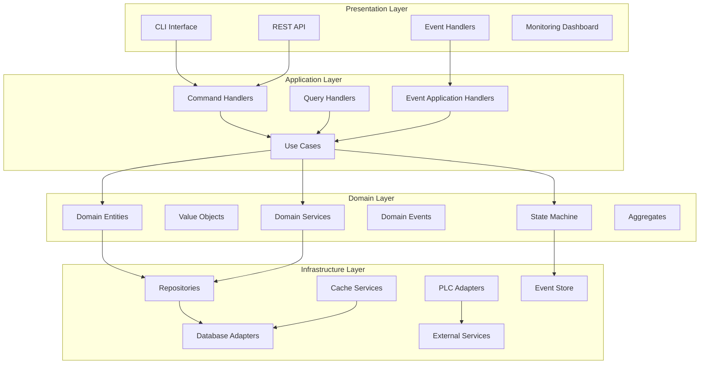
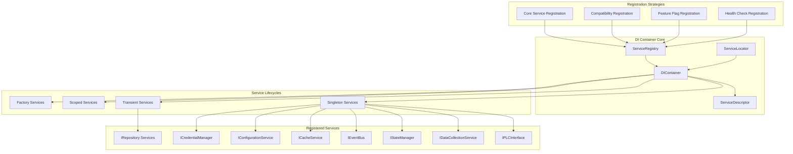
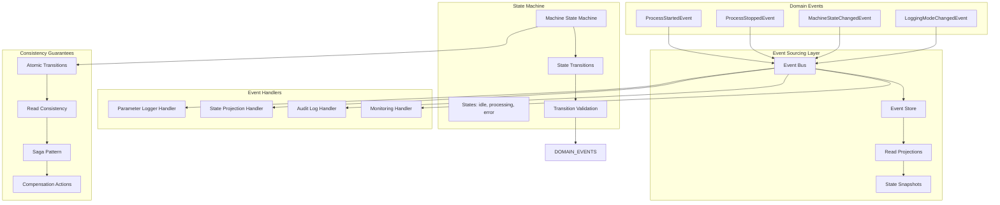
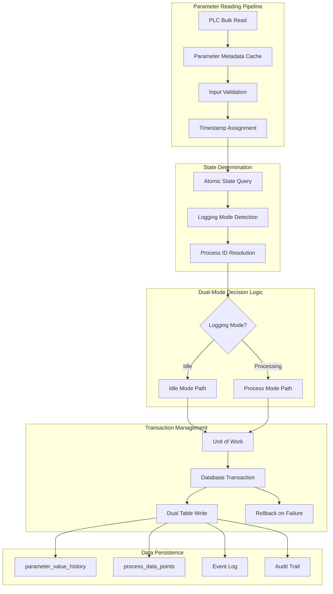
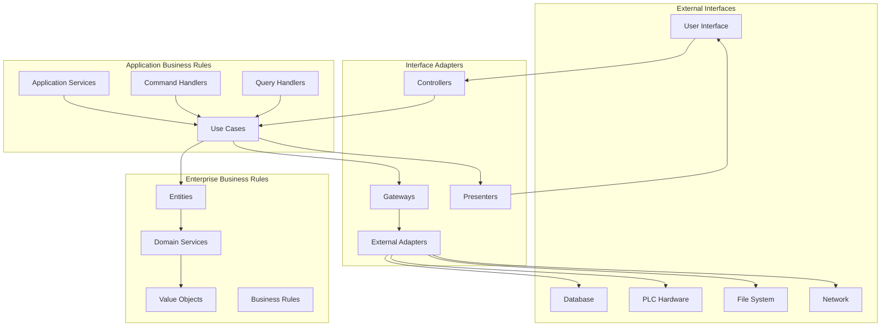
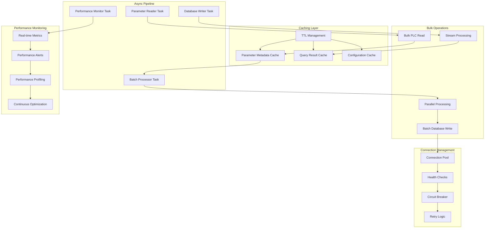
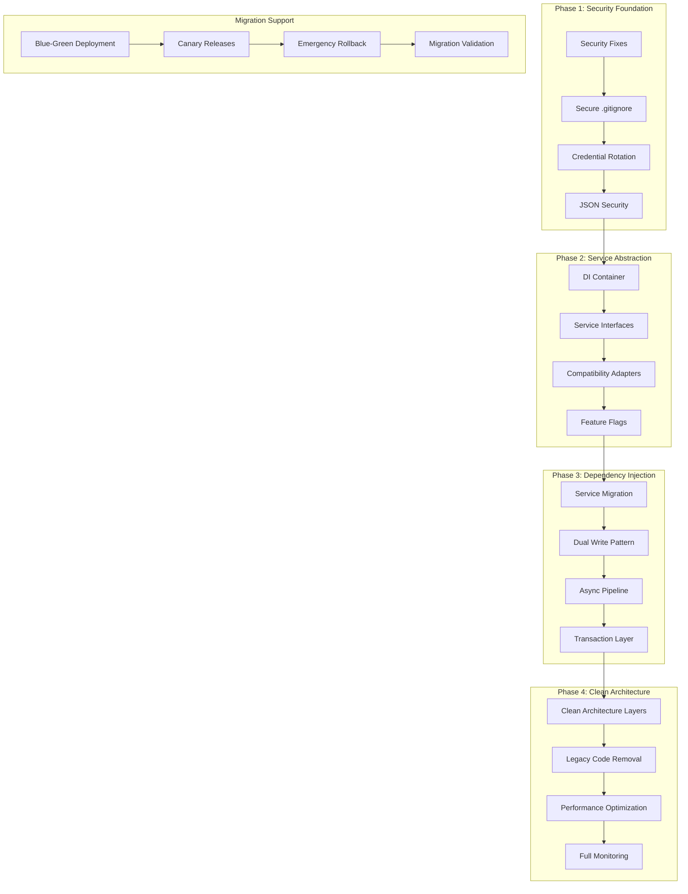
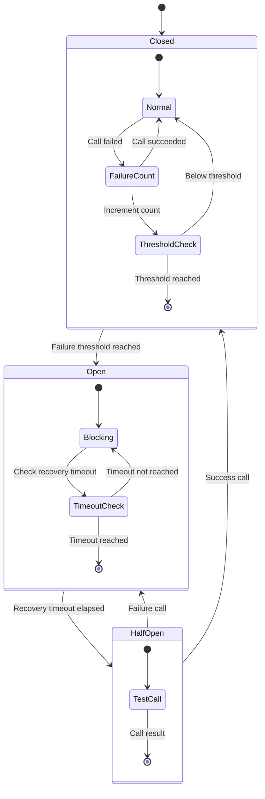
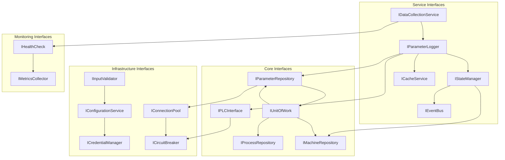

# ALD Control System v2.0 - Architectural Diagrams

## System Architecture Overview

## Dependency Injection Container Architecture

## Event-Driven State Management Architecture

## Data Flow Architecture for Dual-Mode Logging

## Clean Architecture Layer Dependencies

## Performance Optimization Architecture

## Security Architecture

```mermaid
graph TB
    subgraph "Authentication & Authorization"
        AUTH[Authentication Service]
        RBAC[Role-Based Access Control]
        JWT[JWT Token Management]
        SESSION[Session Management]
    end

    subgraph "Credential Management"
        VAULT[Credential Vault]
        ROTATION[Automatic Rotation]
        ENCRYPTION[Encryption at Rest]
        SECURE_CONFIG[Secure Configuration]
    end

    subgraph "Input Validation"
        VALIDATOR[Input Validator]
        SANITIZATION[Data Sanitization]
        SCHEMA[Schema Validation]
        RATE_LIMIT[Rate Limiting]
    end

    subgraph "Security Monitoring"
        AUDIT[Audit Logging]
        THREAT[Threat Detection]
        ANOMALY[Anomaly Detection]
        INCIDENT[Incident Response]
    end

    subgraph "Secure Communications"
        TLS[TLS Encryption]
        CERT[Certificate Management]
        MODBUS_SEC[Secure Modbus]
        API_SEC[API Security]
    end

    AUTH --> RBAC
    RBAC --> JWT
    JWT --> SESSION

    VAULT --> ROTATION
    ROTATION --> ENCRYPTION
    ENCRYPTION --> SECURE_CONFIG

    VALIDATOR --> SANITIZATION
    SANITIZATION --> SCHEMA
    SCHEMA --> RATE_LIMIT

    AUDIT --> THREAT
    THREAT --> ANOMALY
    ANOMALY --> INCIDENT

    TLS --> CERT
    CERT --> MODBUS_SEC
    MODBUS_SEC --> API_SEC
```

## Migration Architecture

## Circuit Breaker Pattern Implementation

## Interface Dependency Graph

## Conclusion

These architectural diagrams provide a comprehensive visual representation of the ALD Control System v2.0 redesign, showing:

1. **Clean separation of concerns** across architectural layers
2. **Dependency injection** replacing global singletons
3. **Event-driven state management** eliminating race conditions
4. **Performance optimization** through async pipelines and caching
5. **Security architecture** with comprehensive threat mitigation
6. **Migration strategy** with zero-downtime deployment
7. **Interface abstractions** enabling testability and maintainability

The architecture addresses all critical issues identified by the specialist agents while maintaining backward compatibility during the migration process.