# ALD Recipe Execution Process - Comprehensive Documentation

This document provides a detailed analysis of the Atomic Layer Deposition (ALD) recipe execution process, based on comprehensive investigation of the system architecture.

## Executive Summary

The ALD control system implements a sophisticated 6-layer execution architecture that transforms external commands into precise hardware control operations. The system features enterprise-grade resilience, dual-mode data collection, and robust error handling throughout the execution chain.

## Architecture Overview

### 6-Layer Command-to-Hardware Execution Chain

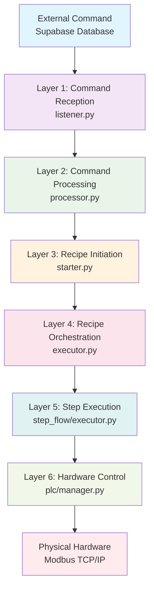

## Detailed Layer Analysis

### Layer 1: Command Reception (`src/command_flow/listener.py`)

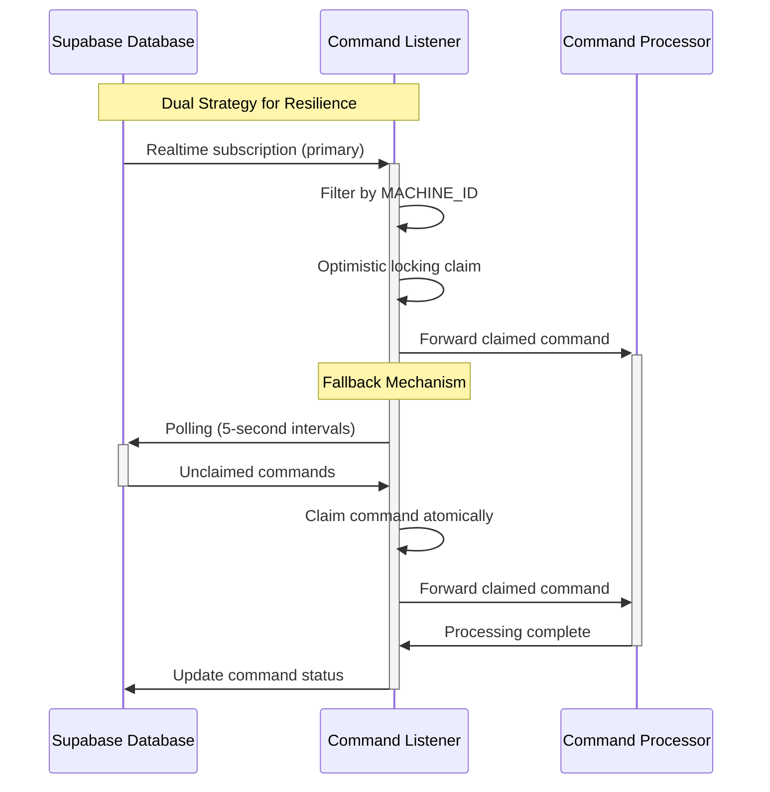

**Key Features:**

- Dual listening strategy (realtime + polling)
- Machine-specific filtering prevents cross-machine interference
- Optimistic locking prevents concurrent execution
- Comprehensive error handling with retry logic

### Layer 2: Command Processing (`src/command_flow/processor.py`)

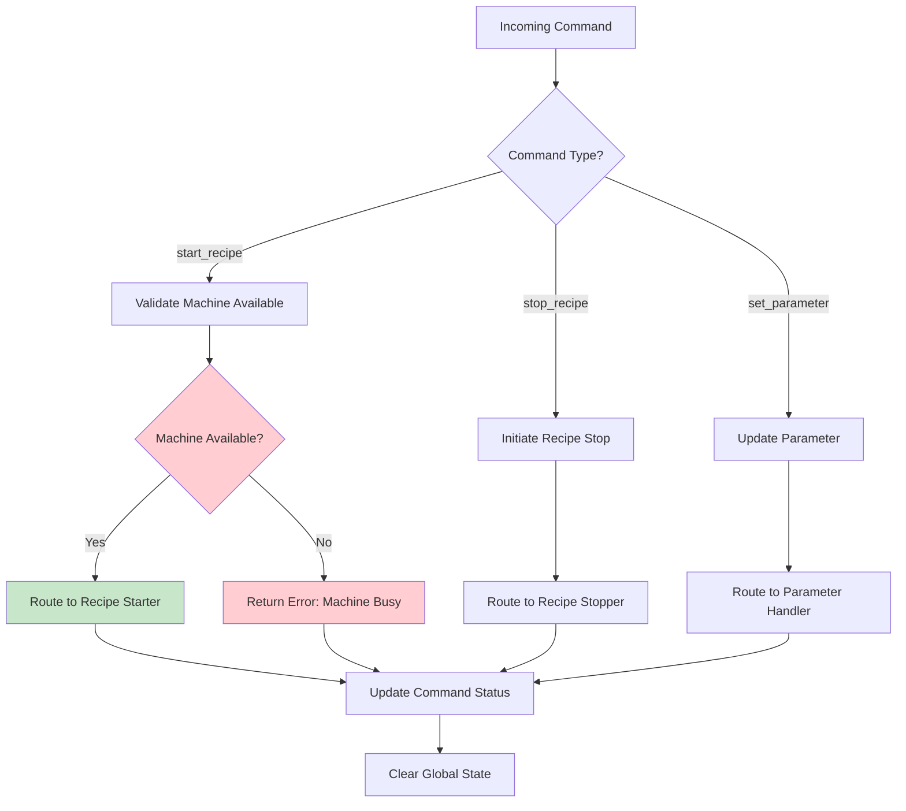

**Key Features:**

- Type-based routing with validation
- Race condition prevention through machine availability checks
- Global state management and cleanup
- Exception handling with status updates

### Layer 3: Recipe Initiation (`src/recipe_flow/starter.py`)

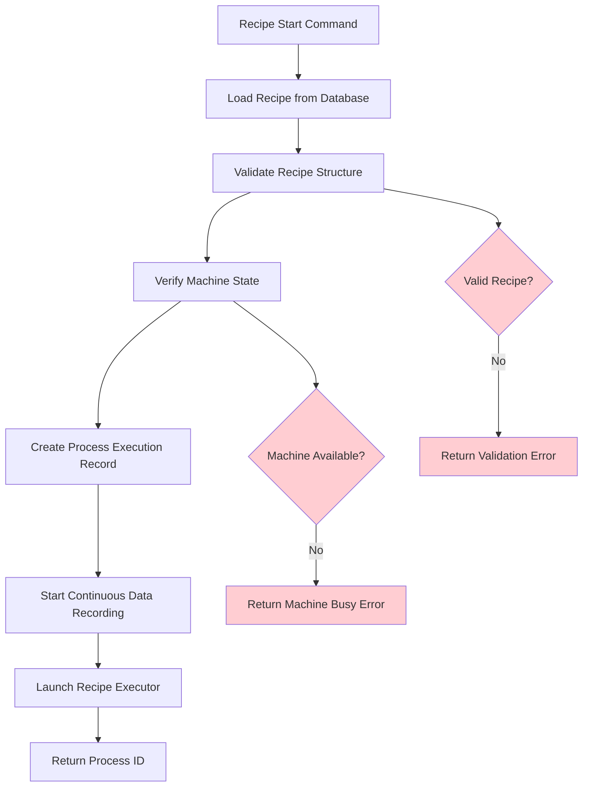

**Key Features:**

- Comprehensive recipe validation
- Machine state verification
- Transaction-based process creation
- Automatic data recording service integration

### Layer 4: Recipe Orchestration (`src/recipe_flow/executor.py`)

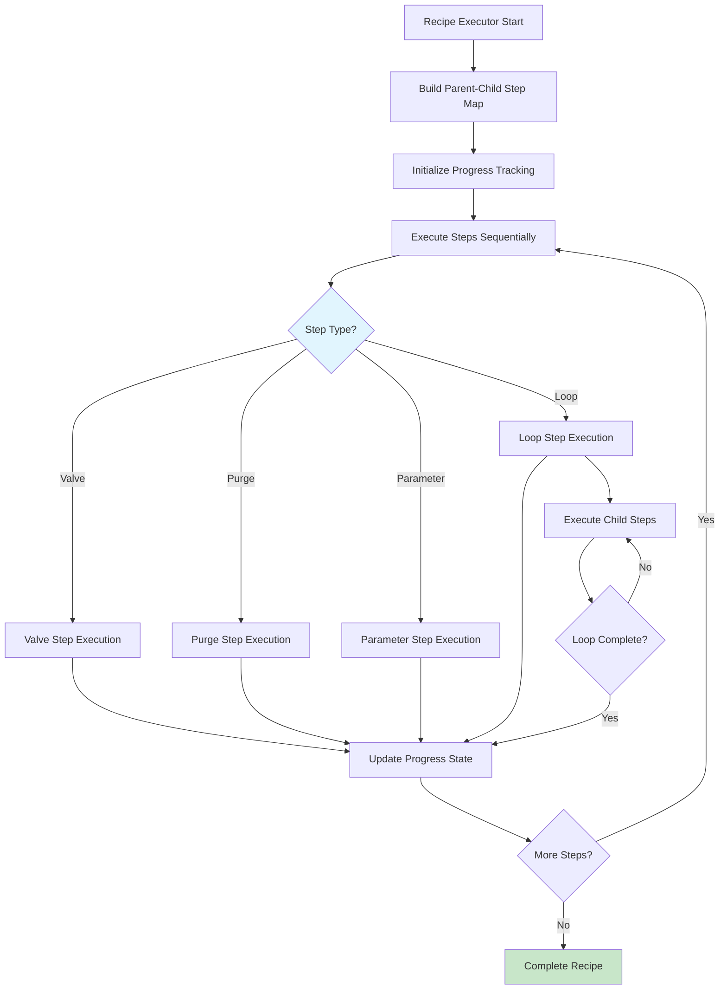

**Key Features:**

- Step-by-step orchestration with progress tracking
- Loop iteration management with nested step execution
- Cancellation support throughout execution
- Error propagation and cleanup mechanisms

### Layer 5: Step Execution (`src/step_flow/executor.py`)

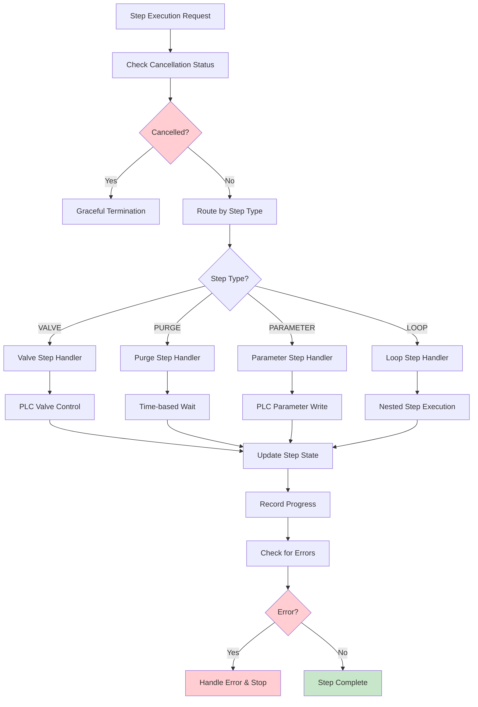

**Key Features:**

- Type-specific step routing with dual configuration support
- Cancellation checks before each execution
- Progress state persistence in database
- Error handling per step type

### Layer 6: Hardware Control (`src/plc/manager.py`)

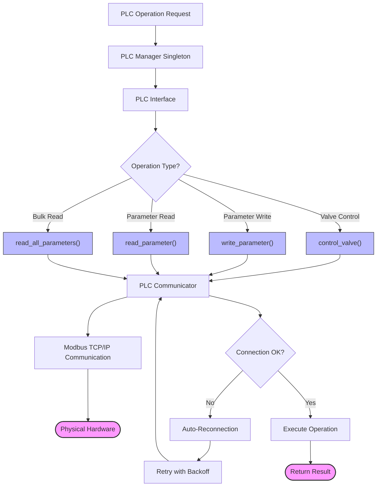

**Key Features:**

- Centralized hardware access through singleton manager
- Connection health monitoring and auto-reconnection
- Retry logic with exponential backoff
- Support for real and simulation modes

## Recipe Lifecycle Management

### 3-Phase Recipe Lifecycle

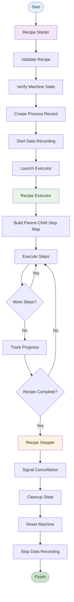

## Step Types and Execution Patterns

### Step Type Architecture

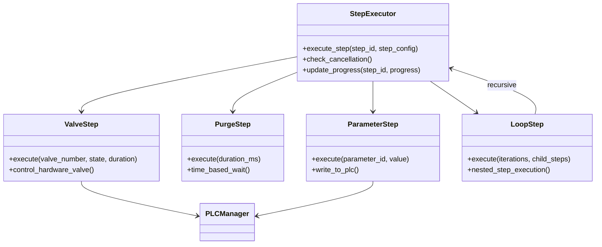

## Data Collection Architecture

### Dual-Layer Data Collection System

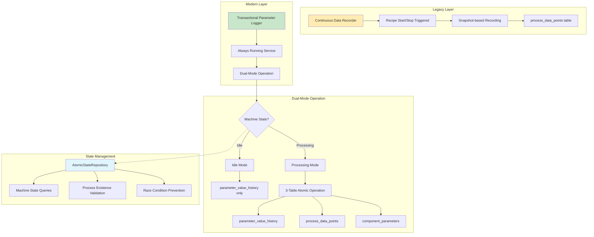

### Data Flow During Recipe Execution

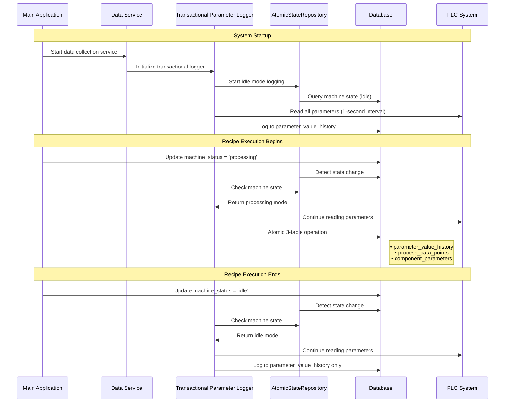

## PLC Architecture and Hardware Integration

### PLC Component Architecture

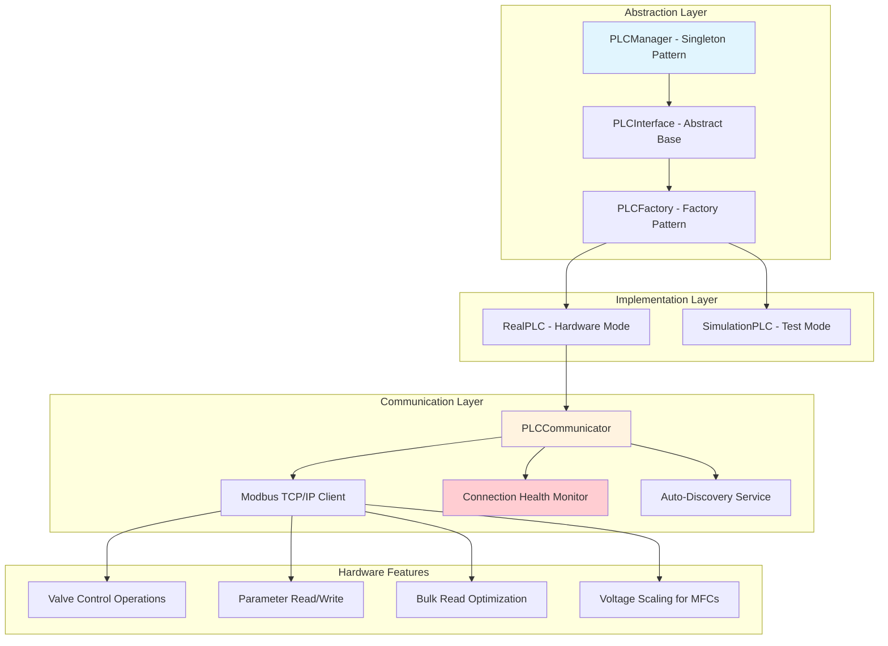

### Hardware Control Flow During Recipe Execution

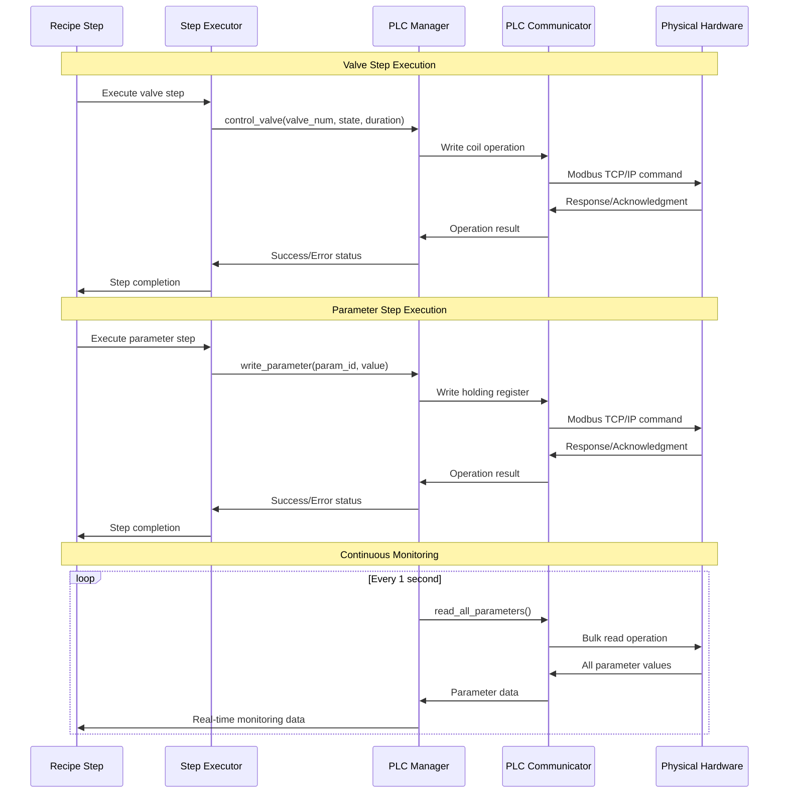

## Error Handling and Recovery

### Multi-Level Error Handling Strategy

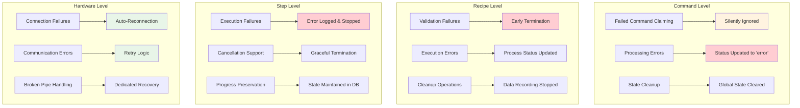

### Signal Handling and Graceful Shutdown

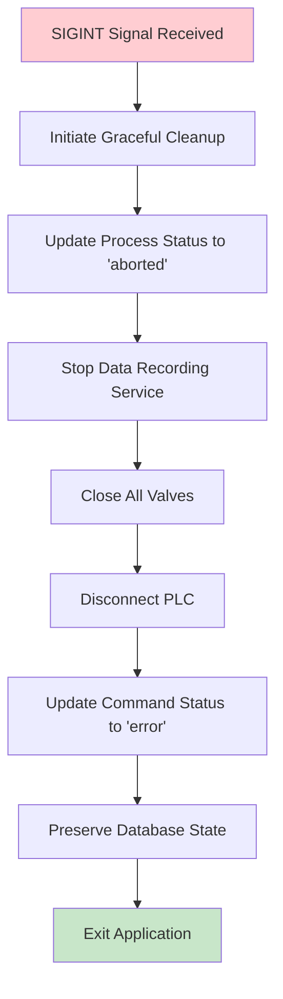

## Status Tracking and Monitoring

### Real-Time Status Management

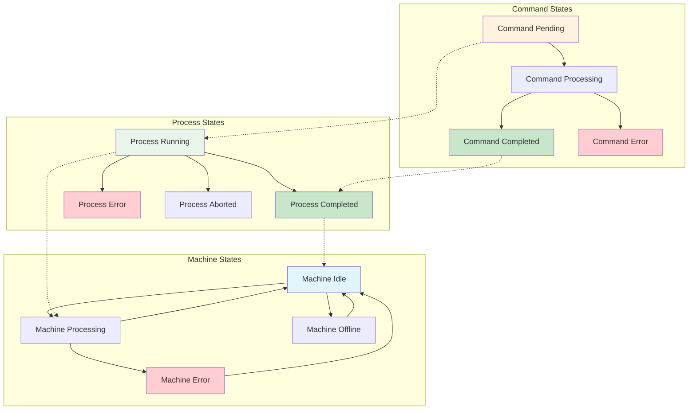

## Key Integration Points

### File-Level Integration Map

```mermaid
graph TB
    A[ALD Recipe Execution] --> B[Command Flow]
    A --> C[Recipe Flow]
    A --> D[Step Flow]
    A --> E[Data Collection]
    A --> F[PLC Integration]
    B --> B1["src/command_flow/listener.py"]
    B --> B2["src/command_flow/processor.py"]
    B --> B3["src/command_flow/state.py"]
    B --> B4["src/command_flow/status.py"]
    C --> C1["src/recipe_flow/starter.py"]
    C --> C2["src/recipe_flow/executor.py"]
    C --> C3["src/recipe_flow/stopper.py"]
    C --> C4["src/recipe_flow/continuous_data_recorder.py"]
    D --> D1["src/step_flow/executor.py"]
    D --> D2["src/step_flow/valve_step.py"]
    D --> D3["src/step_flow/parameter_step.py"]
    D --> D4["src/step_flow/purge_step.py"]
    D --> D5["src/step_flow/loop_step.py"]
    E --> E1["src/data_collection/service.py"]
    E --> E2["src/data_collection/continuous_parameter_logger.py"]
    E --> E3["src/data_collection/transactional/"]
    F --> F1["src/plc/manager.py"]
    F --> F2["src/plc/interface.py"]
    F --> F3["src/plc/real_plc.py"]
    F --> F4["src/plc/communicator.py"]
    style A fill:#e1f5fe
    style B fill:#f3e5f5
    style C fill:#e8f5e8
    style D fill:#fff3e0
    style E fill:#fce4ec
    style F fill:#e0f2f1
```

## Performance Characteristics

### System Performance Metrics

| Component         | Frequency                   | Response Time | Throughput           |
| ----------------- | --------------------------- | ------------- | -------------------- |
| Command Listening | 5-second polling + realtime | < 1 second    | High                 |
| Parameter Reading | 1-second intervals          | < 500ms       | Continuous           |
| Step Execution    | Variable by step type       | 10ms - 30min  | Sequential           |
| Data Logging      | 1-second intervals          | < 100ms       | ~50 parameters/sec   |
| PLC Communication | On-demand + continuous      | < 50ms        | Optimized bulk reads |

### Scalability Features

- **Bulk Read Optimization**: Reduces PLC communication overhead
- **Connection Pooling**: Singleton manager prevents connection thrashing
- **Atomic Transactions**: ACID guarantees without performance degradation
- **Dual-Mode Operation**: Optimizes data collection based on system state
- **Health Monitoring**: Proactive connection management

## Production Readiness Features

### Enterprise-Grade Capabilities

1. **Reliability**

   - Auto-reconnection with exponential backoff
   - Connection health monitoring
   - Comprehensive error recovery
   - Transaction rollback capabilities
2. **Observability**

   - Real-time status tracking
   - Comprehensive logging throughout execution chain
   - Progress monitoring at multiple levels
   - Performance metrics collection
3. **Maintainability**

   - Clean separation of concerns
   - Abstract interfaces for testing
   - Simulation mode for development
   - Consistent error handling patterns
4. **Scalability**

   - Optimized communication patterns
   - Efficient data collection strategies
   - Resource cleanup and management
   - Performance monitoring

## Conclusion

The ALD recipe execution system represents a sophisticated industrial control architecture that successfully bridges the gap between high-level recipe management and precise hardware control. The 6-layer execution chain ensures reliable command processing, while the dual-mode data collection system provides comprehensive monitoring capabilities.

Key strengths include:

- **Robustness**: Enterprise-grade error handling and recovery
- **Flexibility**: Support for multiple step types and execution patterns
- **Observability**: Comprehensive monitoring and status tracking
- **Maintainability**: Clean architecture with proper separation of concerns
- **Performance**: Optimized communication and data collection patterns

This architecture provides a solid foundation for reliable ALD process control in production environments.
